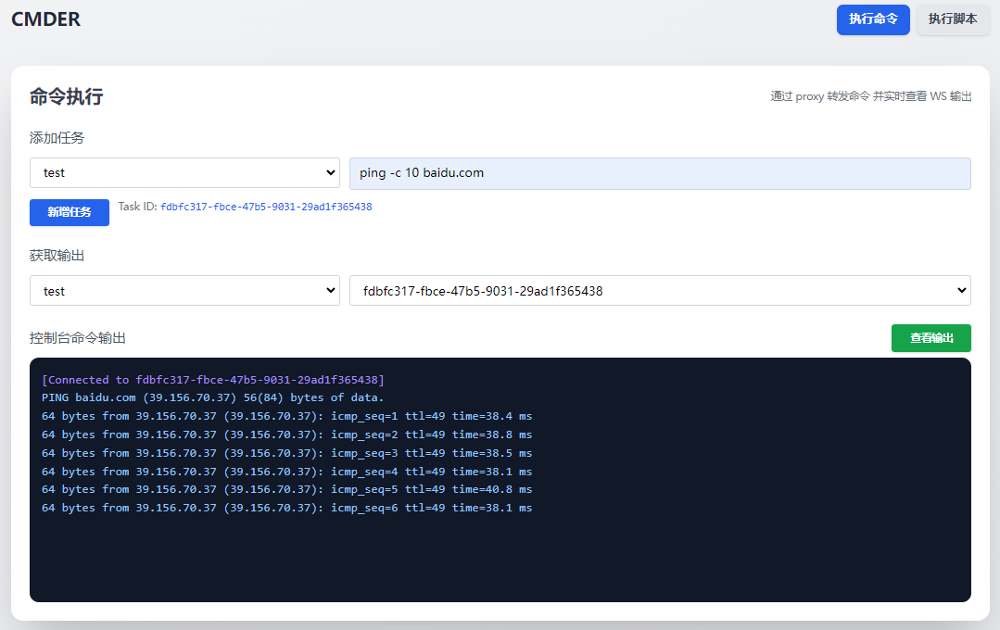
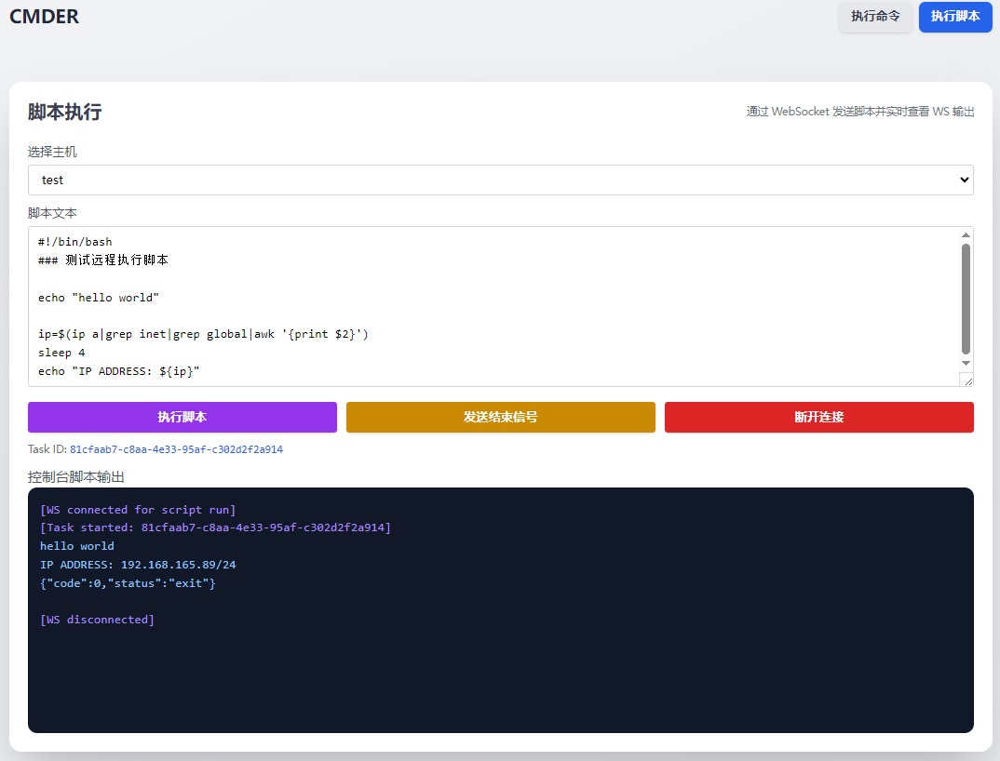

### cmder

- **说明**
1. 通过cmd-proxy代理转发需要执行的操作到cmd-agent所在主机进行操作
2. 部署:
   1. make 
   2. 将bin目录下生成的打包文件分别部署到指定主机上

- **示例**  
  
  

<!-- - **接口测试**
```bash
curl -X POST "http://127.0.0.1:5533/api/cmd/run?name=test"   -d '{"cmd":"for((i=0;i<100;i++)) do echo hello;sleep 1;done"}' -H 'Content-Type: application/json'

# npm install -G wscat
wscat -c "ws://127.0.0.1:5533/api/cmd/out?name=test&task_id=0929129c-a44b-4bab-8f64-99a7cba45339"
``` -->
